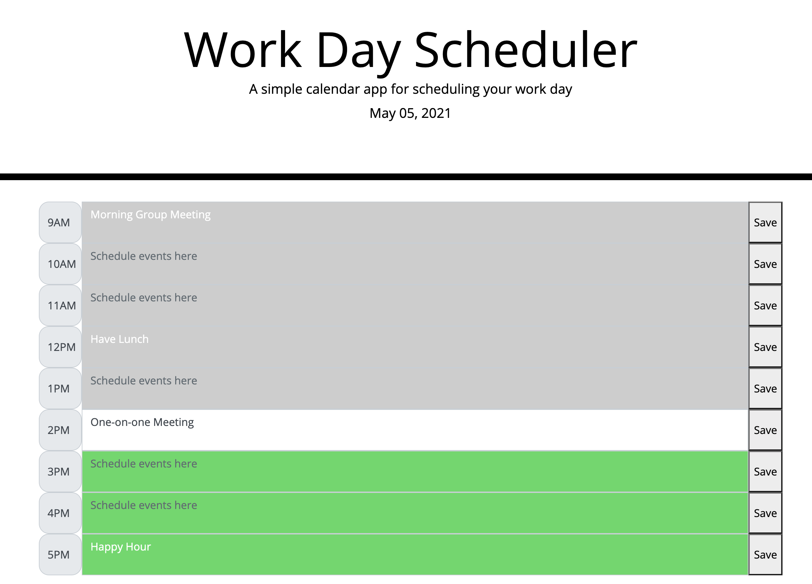

# WorkDayScheduler
## Description
The goal of this project was to create a work day scheduler using jQuery, Moment.js, and a CSS Framework (Bootstrap). 
## Usage
- Today's date is displayed at the top of the screen.
- User can enter tasks into the text fields for each time block in the work day (9AM - 5PM) and click 'Save' to commit them to local storage.
- Upon page reload, the previously stored tasks are displayed in the appropriate time blocks and can be overwritten by new tasks.
- Past time blocks are displayed in gray while future time blocks are green, indicating to the user which time blocks remain to be scheduled for the day. 

.

![Visit the deployed application] (https://emrendle.github.io/WorkDayScheduler/).